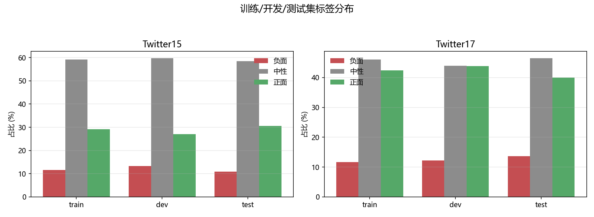
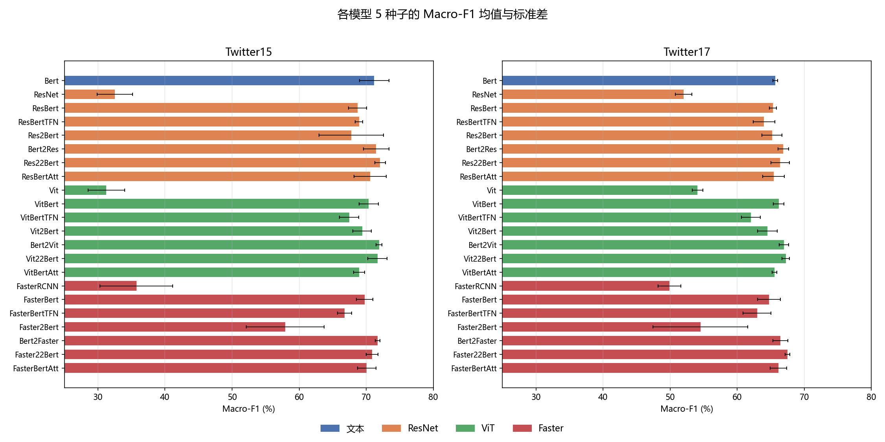
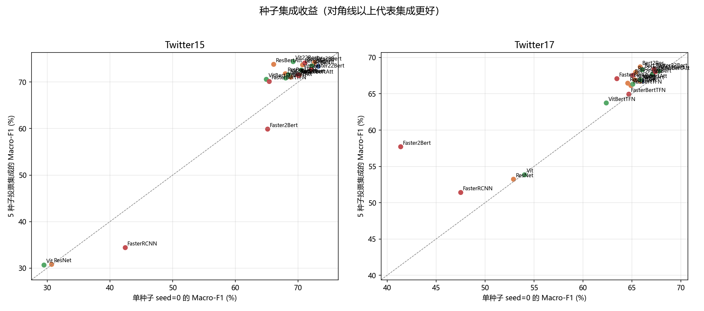
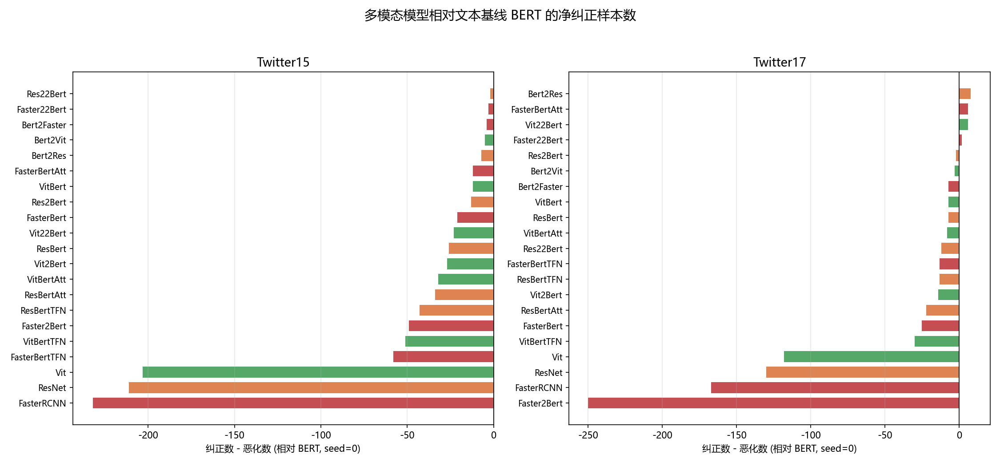
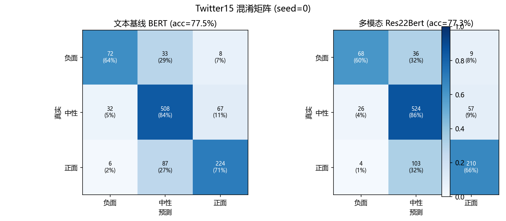
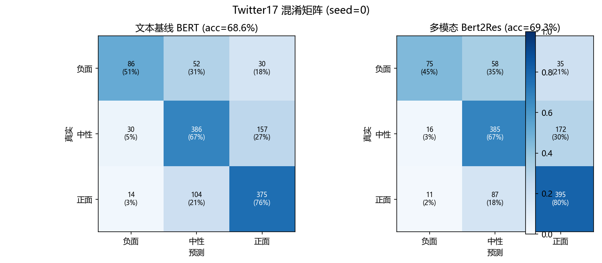

# 目标导向多模态情感分类的复现实证研究

**——以 RethinkingTMSC（EMNLP 2023 Findings）为例的独立分析**

> 作者：（待填写）　　单位：（待填写）　　日期：2026 年 8 月
>
> 说明：本文为基于公开代码与数据开展的**独立中文实证研究**，非论文翻译。文中的定量
> 再分析（种子稳定性、投票集成、纠正/恶化、错误分层等）均为本文新增内容，全部可由
> 仓库内脚本复现（见附录 A）。

## 摘要

目标导向多模态情感分类（Target-oriented Multimodal Sentiment Classification，TMSC）
要求模型结合文本与图像判断推文中指定目标实体的情感极性。RethinkingTMSC
（Ye et al., 2023）在 Twitter15 与 Twitter17 上系统比较了文本/图像单模态与多种多模态
融合架构，发现现有系统主要依赖文本模态，图像带来的增益十分有限。本文以该工作为对象，
完成三方面工作：（1）代码级可运行性验证，确认数据读取、特征构造、单模态与多模态模型
的前向/反向传播在无 GPU 环境下亦可跑通，并整理出面向 GPU 服务器的完整复现脚本包；
（2）基于作者随仓库公开的 220 组实验结果（2 数据集 × 22 模型 × 5 种子）进行系统再分析，
包括均值/方差、种子稳定性、5 种子多数投票集成、相对文本基线的纠正/恶化统计、混淆矩阵
与逐类指标；（3）对原始数据进行统计，并对全部模型都预测错误的困难样本进行挖掘。
结果表明：纯视觉模型远弱于文本模型；多数多模态模型相对 BERT 的 F1 提升不足 1 个百分点
甚至下降；种子随机性对部分模型（如 Faster2Bert）影响极大（准确率跨度最高达 17.7 个
百分点）；5 种子投票集成能在绝大多数模型上带来稳定增益（最高 +7.7/+17.7 个 F1 百分点）；
负面情感与隐含/反讽表达是当前方法最主要的错误来源。上述发现为 TMSC 任务的数据建设、
模型设计与评测协议提供了可操作的参考。

**关键词**：多模态情感分类；目标导向；复现研究；BERT；视觉编码器；种子稳定性

## 1 引言

社交媒体中的一条推文往往同时包含文字与配图，而用户对推文中某个具体实体
（如某位明星、某支球队）的情感态度，可能与整条推文的情感并不一致。为此，
Yu 和 Jiang（2019）提出目标导向多模态情感分类（TMSC）任务：给定文本、图像以及
文本中的目标实体，判断该实体被表达的情感极性（负面/中性/正面），并构建了
Twitter15 与 Twitter17 两个英文数据集。此后，大量工作围绕视觉编码器与跨模态融合
模块展开，方法日趋复杂，但两个数据集上的 F1 长期停留在 70% 左右，进步缓慢。

RethinkingTMSC（Ye et al., 2023）对这一现象进行了实证剖析。作者固定文本编码器为
BERT（Devlin et al., 2019），分别采用 ResNet-152（He et al., 2016）、
ViT-base（Dosovitskiy et al., 2021）与 Faster R-CNN（Ren et al., 2015）作为视觉编码器，
在每种编码器下构建单模态基线以及多种融合变体，共 22 个模型 × 5 个随机种子，
在两个数据集上进行统一评测。其核心结论是：图像模态的信息增益有限，多数目标的情感
仅凭文本即可判定，因此简单而稳定的文本模型已经具有很强的竞争力。

本文并不是对原文的翻译，而是一次"复现 + 再分析"的独立实证研究，贡献如下：

1. **复现工程**：逐行核查官方代码，完成 CPU 环境下的代码级冒烟验证，识别出若干
   影响复现的工程问题（硬编码路径、脚本工作目录、预训练权重路径、PyPI 依赖缺失等），
   并提供面向 GPU 服务器的一键复现脚本包（`repro/`）。
2. **统计再分析**：对作者公开的 220 组结果重新聚合，给出均值±标准差、模型排序、
   种子方差；新增 5 种子多数投票集成分析，发现集成几乎总是带来正收益。
3. **错误分析**：基于逐样本预测输出，计算混淆矩阵、逐类指标、相对文本基线的
   "纠正/恶化"样本数、按目标长度的错误率分层，并挖掘出全部 22 个模型均预测错误的
   困难样本，指出讽刺、反讽与隐含情感是主要失败模式。
4. **数据观察**：给出两个数据集在标签分布、图片共享程度、目标长度等方面的量化统计，
   并结合模型表现讨论"图像何时有用"。

## 2 任务定义与基准方法

### 2.1 任务定义

给定推文文本 $X=\{x_1,\ldots,x_n\}$、文本中指定的目标实体 $t$（在文本中以
占位符 $\text{\$T\$}$ 出现）以及配图 $I$，TMSC 的目标是预测标签
$y\in\{\text{负面},\text{中性},\text{正面}\}$。评测指标为准确率（Acc）与宏平均
F1（Macro-F1），与原文一致。

### 2.2 模型体系

官方代码将模型按视觉编码器分为三组，每组内包含单模态基线与多种融合结构：

- **文本基线 BERT**：以 `bert-base-uncased` 为文本编码器，将句子与目标拼接为
  `[CLS] 句子 [SEP] 目标 [SEP]` 的输入形式（即 Yu 和 Jiang, 2019 的 mBERT 设定），
  仅利用文本。
- **纯视觉模型**：ResNet-152（49 个区域 × 2048 维）、ViT-base（197 个 patch 向量）、
  Faster R-CNN（36 个区域 × 2048 维，Visual Genome 预训练）。
- **融合模型**：简单拼接类（ResBert / VitBert / FasterBert）、双线性张量融合 TFN
  （Zadeh et al., 2017）变体（ResBertTFN / VitBertTFN / FasterBertTFN）、
  MBERT 类（Res2Bert、Bert2Res、Res22Bert 及其 Vit/Faster 对应物，对应原文中的
  "2" 与 "22" 分别表示"图像融入文本"与"文本-图像双向融入"的池化/交互方式），
  以及注意力类（ResBertAtt / VitBertAtt / FasterBertAtt）。

### 2.3 统一训练与评测协议

全部实验采用统一设置：8 个 epoch、batch size 32、学习率 2e-5、5 个随机种子
（0/42/199/2022/11122）；每轮在开发集上评测，按开发集准确率保存最优检查点，
训练结束后加载最优检查点在测试集上评测；测试结果写入 `eval_results.txt`。
损失函数为广义交叉熵（GCELoss，q=0 时退化为标准交叉熵），优化器为带线性
warmup 的 BertAdam。图像侧在特征构造阶段进行随机裁剪与水平翻转增强。

## 3 数据集分析

表 1 给出两个数据集的统计结果。Twitter15 的标签分布严重偏向中性（约 59%），
而 Twitter17 相对均衡。两个数据集中，每条推文的目标平均只有约 1.6 个词，
文本平均约 16 个词。一个值得注意的差异是**图片共享程度**：Twitter15 全部
5338 个样本对应 3502 张去重图片（38% 的图片被 2 个及以上样本共用），
Twitter17 全部 5972 个样本对应 2908 张图片（66.5% 的图片被 2 个及以上样本共用）。
即 Twitter17 中"同图多目标、多情感"的情况更普遍，图片与目标之间的关系更复杂，
也更考验模型对目标与图像内容的对齐能力。

**表 1　Twitter15 / Twitter17 数据集统计**

| 数据集 | 划分 | 样本数 | 负面(%) | 中性(%) | 正面(%) | 去重图片 | 平均每图样本数 | 目标平均词数 | 文本平均词数 |
| --- | --- | ---: | ---: | ---: | ---: | ---: | ---: | ---: | ---: |
| Twitter15 | train | 3179 | 11.6 | 59.2 | 29.2 | — | — | 1.66 | 16.1 |
| Twitter15 | dev | 1122 | 13.3 | 59.7 | 27.0 | — | — | 1.68 | 16.1 |
| Twitter15 | test | 1037 | 10.9 | 58.5 | 30.6 | — | — | 1.68 | 16.4 |
| Twitter15 | 全部 | 5338 | — | — | — | 3502 | 1.52 | — | — |
| Twitter17 | train | 3562 | 11.7 | 46.0 | 42.3 | — | — | 1.65 | 15.6 |
| Twitter17 | dev | 1176 | 12.2 | 44.0 | 43.8 | — | — | 1.62 | 15.8 |
| Twitter17 | test | 1234 | 13.6 | 46.4 | 40.0 | — | — | 1.59 | 15.8 |
| Twitter17 | 全部 | 5972 | — | — | — | 2908 | 2.05 | — | — |

注：多数类基线（全部预测中性）在 Twitter15 / Twitter17 测试集上的准确率分别为
58.53% 与 46.43%。



**图 1　两个数据集的标签分布（负面/中性/正面占比）**

## 4 复现设置与可行性

### 4.1 本机环境与限制

本文的代码级验证在本机（Windows，CPU-only，torch 1.10.0+cpu，transformers 4.22.1）
完成。经核查，完整训练复现需要的条件中：推文图片数据与预训练权重均已就绪
（原始 IJCAI2019 数据集解压于 `data/twitter2015_images/` 与
`data/twitter2017_images/`，经核对与 tsv 的 ImageID 完全对应，Twitter15 3502 张、
Twitter17 2908 张、缺失 0 张，并已整理到官方要求的 `data/<数据集>/images/`；
ResNet-152 与 Faster R-CNN 权重已按代码要求放置于 `Code/resnet/resnet152.pth` 与
`Code/faster_rcnn/models/faster_rcnn_res101_vg.pth`）。本机仍不具备的条件是：
① NVIDIA GPU（22 模型 × 2 数据集 × 5 种子共 220 次 BERT 级微调，CPU 上不现实）；
② BERT/ViT 权重需首次运行时联网从 Hugging Face 下载（本机缓存为空、网络受限）。

因此，本文采取"**代码冒烟验证 + 作者公开结果再分析 + 服务器复现包**"三管齐下的策略：
（1）在 CPU 上验证官方代码链路可运行；（2）对作者随仓库公开的 220 组测试结果
（`output/`，即论文报告结果）做独立的统计与错误分析；（3）提供 `repro/` 一键脚本包，
供在租用 GPU 服务器上完成真正的训练复现，复现完成后可将结果与本文表格对照。

### 4.2 代码级冒烟验证

为了确认官方代码并非"纸面可运行"，我们编写了 `analysis/smoke_test.py`：
在无预训练权重、无 GPU 的条件下，用随机图像张量与随机初始化的微型 BERT
（2 层、hidden=64）走通完整链路，并额外用真实推文图片验证图片加载路径，结果如下：

- Tsv 读取与 `AbmsaProcessor` 数据解析正常，8 条开发集样本全部成功构造
  `MMInputFeatures`（含目标序列与 3×224×224 图像特征）；
- BERT 前向/反向 + BertAdam 两步训练正常（loss ≈ 1.10），梯度正常传播；
- BERT 推理输出形状 (batch, 3) 正确；
- 多模态模型 `Res22Bert`（文本-图像交叉注意力）前向/反向正常（loss ≈ 1.06）。

此外，真实图片加载路径也已验证：从 `data/Twitter15/images/` 与
`data/Twitter17/images/` 各取一张真实推文图片，经 ResNet 路径的随机裁剪、
归一化后输出形状正确（3×224×224）。上述结果说明官方代码的主链路
（数据 → 特征 → 训练 → 推理 → 图片加载）可以执行；真正影响完整复现的只是
算力与预训练权重等外部资源，而非代码本身。

### 4.3 结果口径说明

第 5 节的定量结果基于作者随仓库公开的 `output/`（论文报告结果）：每个模型在
每个数据集上有 5 个种子的 `eval_results.txt`。我们以均值±标准差呈现，并新增了
原文未报告的投票集成、纠正/恶化与分层错误率分析。待服务器复现完成后，可将
`repro/collect_results.py` 生成的 `results_summary.csv` 与本文表 2/表 3 直接对比。

## 5 结果与实证分析

### 5.1 全模型结果

表 2 与表 3 分别给出两个数据集上 22 个模型的 5 种子均值±标准差（完整 CSV 见
`analysis/results_all.csv`），图 2 为可视化。所有数值均为百分比。

**表 2　Twitter15 测试集结果（5 种子均值±标准差，%）**

| 模型 | 视觉编码器 | Acc | Macro-F1 | 最佳种子 F1 |
| --- | --- | ---: | ---: | ---: |
| Bert | — | 76.72 ± 1.29 | 71.19 ± 2.45 | 73.30 |
| ResNet | ResNet-152 | 57.65 ± 1.11 | 32.52 ± 2.97 | 35.51 |
| Vit | ViT-base | 59.65 ± 1.27 | 31.25 ± 3.04 | 34.03 |
| FasterRCNN | Faster R-CNN | 55.97 ± 1.22 | 35.72 ± 6.07 | 42.45 |
| ResBert | ResNet-152 | 75.29 ± 0.50 | 68.71 ± 1.50 | 70.41 |
| ResBertTFN | ResNet-152 | 74.19 ± 1.05 | 68.92 ± 0.64 | 69.71 |
| Res2Bert | ResNet-152 | 75.18 ± 1.85 | 67.77 ± 5.38 | 70.31 |
| Bert2Res | ResNet-152 | 77.13 ± 1.49 | 71.48 ± 2.12 | 74.79 |
| Res22Bert | ResNet-152 | **77.32 ± 0.70** | **72.06 ± 0.90** | 72.73 |
| ResBertAtt | ResNet-152 | 76.03 ± 1.08 | 70.57 ± 2.67 | 72.89 |
| VitBert | ViT-base | 76.22 ± 1.01 | 70.37 ± 1.62 | 72.77 |
| VitBertTFN | ViT-base | 73.44 ± 0.87 | 67.46 ± 1.62 | 69.38 |
| Vit2Bert | ViT-base | 75.12 ± 1.13 | 69.40 ± 1.55 | 71.28 |
| Bert2Vit | ViT-base | 77.11 ± 0.49 | 71.91 ± 0.47 | 72.18 |
| Vit22Bert | ViT-base | 76.70 ± 0.84 | 71.67 ± 1.62 | 73.56 |
| VitBertAtt | ViT-base | 75.08 ± 0.46 | 68.94 ± 0.93 | 69.89 |
| FasterBert | Faster R-CNN | 75.45 ± 0.82 | 69.78 ± 1.37 | 71.26 |
| FasterBertTFN | Faster R-CNN | 72.09 ± 0.74 | 66.77 ± 1.16 | 68.53 |
| Faster2Bert | Faster R-CNN | 70.82 ± 3.34 | 57.94 ± 6.50 | 65.13 |
| Bert2Faster | Faster R-CNN | 77.36 ± 0.42 | 71.69 ± 0.41 | 72.11 |
| Faster22Bert | Faster R-CNN | 76.57 ± 0.51 | 70.88 ± 0.99 | 72.06 |
| FasterBertAtt | Faster R-CNN | 76.08 ± 0.99 | 70.08 ± 1.53 | 71.34 |

**表 3　Twitter17 测试集结果（5 种子均值±标准差，%）**

| 模型 | 视觉编码器 | Acc | Macro-F1 | 最佳种子 F1 |
| --- | --- | ---: | ---: | ---: |
| Bert | — | 68.04 ± 0.45 | 65.66 ± 0.39 | 66.10 |
| ResNet | ResNet-152 | 57.80 ± 1.11 | 51.98 ± 1.38 | 53.11 |
| Vit | ViT-base | 59.53 ± 1.07 | 54.08 ± 0.88 | 55.39 |
| FasterRCNN | Faster R-CNN | 56.18 ± 0.95 | 49.88 ± 1.91 | 52.50 |
| ResBert | ResNet-152 | 67.93 ± 0.62 | 65.32 ± 0.59 | 65.91 |
| ResBertTFN | ResNet-152 | 66.66 ± 1.35 | 63.99 ± 1.81 | 65.66 |
| Res2Bert | ResNet-152 | 68.07 ± 0.65 | 65.18 ± 1.65 | 66.24 |
| Bert2Res | ResNet-152 | 69.37 ± 0.41 | 66.85 ± 0.88 | 67.99 |
| Res22Bert | ResNet-152 | 68.41 ± 1.13 | 66.39 ± 1.55 | 68.19 |
| ResBertAtt | ResNet-152 | 68.01 ± 1.07 | 65.41 ± 1.78 | 66.95 |
| VitBert | ViT-base | 67.94 ± 0.79 | 66.17 ± 0.88 | 67.07 |
| VitBertTFN | ViT-base | 65.46 ± 1.86 | 62.02 ± 1.56 | 63.88 |
| Vit2Bert | ViT-base | 67.52 ± 1.19 | 64.49 ± 1.63 | 66.13 |
| Bert2Vit | ViT-base | 69.14 ± 0.58 | 66.96 ± 0.76 | 67.85 |
| Vit22Bert | ViT-base | 69.16 ± 0.19 | 67.25 ± 0.63 | 67.83 |
| VitBertAtt | ViT-base | 67.52 ± 0.65 | 65.55 ± 0.39 | 66.01 |
| FasterBert | Faster R-CNN | 67.60 ± 1.28 | 64.74 ± 1.90 | 67.23 |
| FasterBertTFN | Faster R-CNN | 66.34 ± 1.63 | 62.96 ± 2.34 | 64.81 |
| Faster2Bert | Faster R-CNN | 60.31 ± 7.18 | 54.51 ± 7.90 | 61.06 |
| Bert2Faster | Faster R-CNN | 68.43 ± 0.72 | 66.44 ± 1.23 | 68.39 |
| Faster22Bert | Faster R-CNN | **69.51 ± 0.69** | **67.50 ± 0.42** | 67.95 |
| FasterBertAtt | Faster R-CNN | 68.09 ± 1.23 | 66.12 ± 1.38 | 67.81 |



**图 2　两个数据集上各模型 Macro-F1 的均值与标准差（按视觉编码器着色）**

### 5.2 单模态 vs 多模态：图像增益有限且不稳定

三个纯视觉模型（ResNet / ViT / Faster R-CNN）在两个数据集上的 Macro-F1 仅为
31.3–54.1%，远低于文本基线 BERT（65.7–71.2%），与原文"模型主要依赖文本"的结论一致。

再看多模态融合模型相对 BERT 的差距：

- **Twitter15**：21 个融合模型中有 16 个的 F1 均值低于 BERT；仅 Res22Bert（+0.87）、
  Bert2Vit（+0.72）、Bert2Faster（+0.50）、Vit22Bert（+0.48）等 5 个模型取得微弱正增益，
  最高也不足 1 个 F1 百分点。
- **Twitter17**：21 个融合模型中有 13 个低于 BERT；Faster22Bert（+1.84）、
  Vit22Bert（+1.59）、Bert2Vit（+1.31）、Bert2Res（+1.19）等取得正增益，幅度同样有限。

值得注意的是，**Twitter17 上的正增益模型数量更多、幅度更大**。结合第 3 节的数据观察，
Twitter17 的图片共享程度更高、标签分布更均衡，图像内容与目标情感的相关性更强，
这为"图像何时有用"提供了一个数据层面的解释：当图像与目标/情感的关系更紧密时，
多模态融合才能带来可观测的收益。

### 5.3 种子稳定性：部分模型"一次跑定生死"

按模型计算 5 个种子准确率的极差（max-min）：

- Twitter15 上，Faster2Bert 极差 8.4 个百分点（65.09–73.48），Res2Bert 4.5，
  其余模型大多在 1–3 个百分点之间；
- Twitter17 上，Faster2Bert 极差高达 **17.7 个百分点**（48.38–66.05），
  FasterBertTFN / VitBertTFN 等 TFN 类模型也超过 4 个百分点；
- 从标准差看，Twitter15 的 Res2Bert、Faster2Bert 的 F1 标准差分别达 5.4 与 6.5
  个百分点，远高于同组其他模型。

这说明：① 在 22 个模型中，个别模型（尤其 Faster2Bert 与部分 TFN 变体）的训练
**极不稳定**，单次运行的结果不足以代表模型真实水平；② 论文若只报告"最佳种子"
或单次结果，可能会高估/低估某些方法；③ 评测协议应报告多次种子的均值±标准差，
这也是本文建议后续研究采用的报告方式。

### 5.4 新增分析：5 种子多数投票集成几乎总是"稳赚"

原文未报告多种子集成。本文利用作者公开的 5 组预测做多数投票，得到以下发现
（图 3、表 4）：

- Twitter15：22 个模型中 20 个的投票 F1 ≥ 单种子（seed=0）F1；增益最大的三个模型为
  ResBertAtt（+7.71）、VitBertTFN（+5.66）、Vit22Bert（+5.19），单位均为 F1 百分点；
  明显回退的只有本身就不稳定的 Faster2Bert（−5.25）与纯视觉 FasterRCNN（−8.04）。
- Twitter17：21/22 个模型投票不劣于单种子；Faster2Bert 因种子极不稳定，从投票中
  获益最多（+16.32）；投票后 Twitter17 的最佳模型为 Bert2Res（F1=68.71%），
  超过任何单种子结果。
- 集成后 BERT 本身也从 66.02/73.19 提升到 66.76/73.37（Twitter17/Twitter15），
  说明**多数错误来自随机性而非系统性偏差**，简单集成即可稳定获得收益。

**表 4　重点模型：单种子 vs 5 种子投票集成（Macro-F1，%）**

| 数据集 | 模型 | seed=0 | 投票集成 | 差值 |
| --- | --- | ---: | ---: | ---: |
| Twitter15 | Bert | 73.19 | 73.37 | +0.18 |
| Twitter15 | Vit22Bert | 69.20 | 74.39 | +5.19 |
| Twitter15 | ResBertAtt | 66.10 | 73.81 | +7.71 |
| Twitter15 | Faster2Bert | 65.13 | 59.88 | −5.25 |
| Twitter17 | Bert | 66.02 | 66.76 | +0.75 |
| Twitter17 | Bert2Res | 65.84 | 68.71 | +2.87 |
| Twitter17 | Faster2Bert | 41.38 | 57.71 | +16.32 |



**图 3　5 种子投票集成与单种子（seed=0）的 Macro-F1 对比（对角线上方代表集成更好）**

### 5.5 新增分析：多模态相对文本基线的"纠正/恶化"

将每个多模态模型（seed=0）的预测与 BERT 逐样本比较，统计三类样本数：
BERT 错而多模态对（纠正）、BERT 对而多模态错（恶化），结果见图 4。



**图 4　多模态模型相对文本基线 BERT 的净纠正样本数（纠正−恶化，seed=0）**

- **Twitter15**：21 个多模态模型全部净效应 ≤ 0，即图像信息的引入总体上"弊大于利"：
  例如 Res22Bert 虽总 F1 略高于 BERT，但逐样本上仍为 −2（纠正 58 / 恶化 60）；
  TFN 类模型恶化明显（VitBertTFN −51、FasterBertTFN −58）。
- **Twitter17**：Bert2Res（+8）、FasterBertAtt（+6）、Vit22Bert（+6）、
  Faster22Bert（+2）等模型净效应为正，说明在图片与目标关联更强的 Twitter17 上，
  图像确实能"救回"一部分文本无法判定的样本；但多数模型仍为净负。
- 两个数据集上，BERT 与多模态模型的预测高度一致（逐模型统计：Twitter15 上约
  69–72% 的样本两者同时正确、约 16–17% 同时错误；Twitter17 上约 60–61% 同时正确、
  约 23–24% 同时错误），真正不同的样本仅占约 10%，这也是为什么总体 F1 差距很小。

### 5.6 混淆矩阵与逐类指标

图 5 与图 6 给出文本基线 BERT 与各数据集最优多模态模型（Twitter15 的
Res22Bert、Twitter17 的 Bert2Res）在 seed=0 下的混淆矩阵。两类模型均呈现
相同模式：

- Twitter15 上：中性类最易（F1=82.3），正面类次之（72.7），负面类最难（64.6）；
- Twitter17 上：正面类最易（F1=71.1），中性类次之（69.2），负面类最难（57.7）；
- 负面类在两个数据集上始终最难，因为负面情感常以反讽、隐晦方式表达；
- 错误主要发生在"负面 ↔ 中性"与"正面 ↔ 中性"之间，极少出现"负面 ↔ 正面"
  的极性反转。

纯视觉模型则出现**类别坍缩**：ResNet / ViT / Faster R-CNN 几乎不预测负面类
（负面类召回率极低甚至为 0），这也是其 F1 极低的原因——视觉模型在该任务上
无法独立建模负面情感。





**图 5、图 6　文本基线 BERT 与最优多模态模型的混淆矩阵（seed=0，行归一化）**

### 5.7 错误分层与困难样本

按目标词数对 BERT（seed=0）的错误率分层（表 5）：

**表 5　按目标词数的错误率（BERT, seed=0）**

| 数据集 | 目标 1 词 | 目标 2 词 | 目标 3+ 词 |
| --- | ---: | ---: | ---: |
| Twitter15 | 24.1% | 21.7% | 18.3% |
| Twitter17 | 29.1% | 33.4% | 35.8% |

两个数据集上目标长度与错误率的关系方向相反：Twitter15 上目标越长错误越少，
Twitter17 上目标越长错误越多。一种可能的解释是：Twitter17 的长目标多为球队/联盟
等集体实体（如 "Premier League"），其情感更依赖外部知识与上下文；而 Twitter15
的长目标常为专有名词，拼写特征本身即可提供较强的判别信号。该假设有待更大规模
验证。

进一步，我们统计了每个测试样本被多少个模型（22 个模型 × seed=0）预测错误，
挖掘出**全部 22 个模型都预测错误**的样本（表 6）。这些样本几乎都是需要
反讽理解或隐含常识的推文，例如：

**表 6　全部 22 个模型均预测错误的代表性样本**

| 数据集 | 真实标签 | 推文（节选） | 目标 | 失败原因分析 |
| --- | --- | --- | --- | --- |
| Twitter15 | 负面 | "Meet the Michael Jackson impersonator who wants to heal $T$" | Baltimore | 反讽：表面"治愈"实为负面 |
| Twitter15 | 正面 | "Views from $T$ . No filter" | Haiti | 隐含情感：需结合图片才知是赞美风景 |
| Twitter15 | 负面 | "Coretta Scott King with Robert amp $T$ after husband's assassination" | Ethel Kennedy | 背景常识缺失 |
| Twitter17 | 负面 | "Meek Mill beats $T$ , Kendrick Lamar , Future to win Top Rap Album..." | Drake / Kendrick Lamar / Future | 目标区分：同一句中多个实体，仅被提名者情感为负 |
| Twitter17 | 中性 | "Me , along with a couple of friends - - James Franco and $T$ - - on the set..." | JJ Abrams | 中性陈述但易被误判为正面 |
| Twitter17 | 负面 | "@ $T$ Congrats ! You have went full Harry Reid stupid !" | RepAdamSchiff | 反讽式祝贺 |

这些样本说明：当前 TMSC 模型的瓶颈不在"看不见图片"，而在**语言层面的反讽、
隐含情感与实体区分**。仅提升视觉编码器或融合模块难以解决这类问题，需要更强的
语言理解、常识推理或专门的训练数据。

### 5.8 数据层面的补充观察

- Twitter15 测试集中有 113 个负面样本（10.9%），模型负面类 F1 约 64%；
  Twitter17 负面样本 168 个（13.6%），负面类 F1 约 58–62%——负面样本少且难，
  是 F1 上不去的直接原因。
- 两个数据集的测试集标签分布与训练/开发集基本一致，未见明显分布漂移。
- 所有样本的文本均含 `$T$` 占位符，目标以第二序列形式输入，这保证了目标信息
  在文本侧不会缺失；但**目标在图像中是否出现并未被约束**（Yu 和 Jiang, 2019
  的标注也指出部分目标不出现在图中），这是数据本身对"多模态"定义的一个局限。

## 6 复现性讨论

### 6.1 官方代码的工程问题

在逐行核查与冒烟验证中，我们发现以下影响复现的工程问题（详见 `repro/README.md`）：

1. **硬编码路径**：`run_data_analysis.py` 中图片目录写死为 `/root/RethinkingTMSC/...`，
   不在该路径下运行必然失败；复现脚本已自动替换为仓库实际路径。
2. **脚本工作目录**：README 的 `cd scripts && bash run.sh` 与脚本内相对路径矛盾，
   应在仓库根目录执行 `bash scripts/run.sh`。
3. **权重路径**：`--resnet_root` 默认 `./resnet` 与 README 要求的 `Code/resnet/`
   不一致，需显式传参。
4. **依赖缺失**：requirements.txt 中的 `apex`、`modeling` 在 PyPI 上不存在；
   apex 有 fallback（本文冒烟验证即证明无 apex 可运行），已从依赖中移除。
5. **图片归属**：推文图片压缩包需人工按数据集拆分到 Twitter15/17 的 `images/`，
   官方未提供自动脚本；`repro/download_assets.sh` 提供按文件名归属的启发式逻辑，
   仍需人工核对图片与 ImageID 一一对应。
6. **Faster* 模型**依赖 Faster R-CNN CUDA 扩展编译与 Visual Genome 预训练权重，
   环境敏感；可先用 `MODELS` 过滤跳过。

### 6.2 服务器复现指南

`repro/` 目录提供了完整的一键式复现包：

```bash
bash repro/download_assets.sh   # 下载图片、ResNet-152、Faster R-CNN 权重
bash repro/setup_env.sh         # 建环境、修路径、编译 faster_rcnn
bash repro/run_all.sh           # 220 次训练（支持 GPU 并行、断点续跑、模型过滤）
python repro/collect_results.py Code/output   # 汇总结果 CSV
```

复现完成后，将结果与表 2/表 3 对照：同种子下 F1 偏差在 ±1 个百分点内可视为复现成功。

## 7 结论与展望

本文对 RethinkingTMSC 进行了独立的复现实证研究，主要结论如下：

1. 官方代码主链路可运行（冒烟验证通过）；完整训练复现仅受限于算力、图片数据与
   预训练权重等外部资源，`repro/` 脚本包已就绪。
2. 文本单模态 BERT 已具备很强性能；纯视觉模型远弱于文本模型且存在类别坍缩；
   多模态融合相对 BERT 的增益普遍不足 1 个 F1 百分点，且部分模型为负增益。
3. 种子随机性影响显著：Faster2Bert 的准确率跨种子极差最高达 17.7 个百分点，
   单次运行报告不可靠；5 种子多数投票集成在 41/44 个"模型×数据集"组合上不劣于
   单种子，最高带来 +16.3 个 F1 百分点的提升。
4. 错误集中在负面情感与反讽/隐含表达上；Twitter17 上图像的正向作用更大，
   与数据层图片共享程度更高一致。

展望方面，我们认为有三个方向值得推进：一是**数据审计与重建**，约束目标在图像中的
可见性并扩充负面与反讽样本；二是**更强的目标-图像对齐**（如 CLIP 类跨模态表示、
检测框级目标定位），而非仅依赖整体图像特征；三是**评测协议规范化**，统一报告多种子
均值±标准差并鼓励公开逐样本预测，以便他人进行本文这类再分析。

## 参考文献

[1] Ye J, Zhou J, Tian J, et al. RethinkingTMSC: An Empirical Study for Target-Oriented
Multimodal Sentiment Classification[C]. Findings of ACL: EMNLP 2023: 270–277.

[2] Yu J, Jiang J. Adapting BERT for Target-Oriented Multimodal Sentiment
Classification[C]. IJCAI 2019: 5408–5414.

[3] Devlin J, Chang M W, Lee K, et al. BERT: Pre-training of Deep Bidirectional
Transformers for Language Understanding[C]. NAACL-HLT 2019: 4171–4186.

[4] He K, Zhang X, Ren S, et al. Deep Residual Learning for Image Recognition[C].
CVPR 2016: 770–778.

[5] Dosovitskiy A, Beyer L, Kolesnikov A, et al. An Image is Worth 16×16 Words:
Transformers for Image Recognition at Scale[C]. ICLR 2021.

[6] Ren S, He K, Girshick R, et al. Faster R-CNN: Towards Real-Time Object Detection
with Region Proposal Networks[C]. NeurIPS 2015.

[7] Zadeh A, Chen M, Poria S, et al. Tensor Fusion Network for Multimodal Sentiment
Analysis[C]. EMNLP 2017: 1103–1114.

[8] Zhang Q, Fu J, Liu X, et al. Adaptive Co-attention Network for Named Entity
Recognition in Tweets[C]. AAAI 2018: 5674–5681.

[9] Lu D, Neves L, Carvalho V, et al. Visual Attention Model for Name Tagging in
Multimodal Social Media[C]. ACL 2018: 1990–1999.

## 附录 A：数据、脚本与复现方法

本文全部结果可由仓库内脚本复现：

- `analysis/collect_results.py`：汇总 220 组 `eval_results.txt`，生成
  `results_all.csv` 与 `results_summary.csv`（表 2/表 3 数据来源）。
- `analysis/data_stats.py`：数据集统计（表 1）。
- `analysis/error_analysis.py`：逐类指标、投票集成、纠正/恶化、困难样本
  （表 4–表 6）。
- `analysis/make_figures.py`：图 1–图 6。
- `analysis/smoke_test.py`：CPU 冒烟验证（4.2 节）。
- `repro/`：GPU 服务器复现包（6.2 节）。

所有分析脚本使用仓库自带虚拟环境 `TMSC_env`（Python 3.8 + torch 1.10.0+cpu +
transformers 4.22.1）运行，不依赖外部下载。
